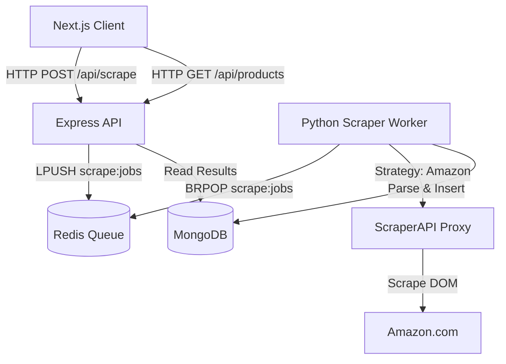

# Rate Flux Comparison Engine - Architecture

This document describes the high-level system architecture and component interactions.

---

## 🏗️ System Components

The system is broken down into 4 primary components (Microservices architecture):

1. **Client (Frontend)**
   - Next.js 14 App Router
   - Renders search UI and product listings
   - Connects to the API Service via HTTP REST
2. **API (Backend Orchestrator)**
   - Node.js 20 + Express + TypeScript
   - Handles client HTTP requests
   - Validates inputs
   - Enqueues jobs to Redis
   - Retrieves final data from MongoDB
3. **Scraper Engine (Worker)**
   - Python 3.11 + Requests + BeautifulSoup + asyncio
   - Runs continuously in the background
   - Pops jobs from Redis `scrape:jobs` queue
   - Executes strategy-specific scraping rules
   - Normalizes data and stores it in MongoDB
4. **Data Layer**
   - **Redis 7:** Job Queue and short-term caching.
   - **MongoDB 6:** Persistent storage for scrapped products and search results.

---

## 🔀 Module Responsibilities

### API Layer
- **`src/routes/scrape.routes.ts`**: Entrypoint for new scrape requests. Validates body shape.
- **`src/routes/product.routes.ts`**: Data retrieval endpoints.
- **`src/lib/redis.ts`**: Handles the `ioredis` job enqueuing logic.

### Scraper Engine Layer
- **`src/worker.py`**: The main persistent asyncio event loop. Fetches jobs and routes them.
- **`src/queue/`**: Responsible for connecting to Redis and doing a non-blocking `BRPOP`.
- **`src/strategies/registry.py`**: Maps string keys (e.g. `'amazon'`) to concrete Python Strategy classes.
- **`src/strategies/base.py`**: The abstract base class dictating what a scraper must implement (`search()` and `normalize_price()`).

---

## 🔄 Data Flow

1. **Initiation**: User types "iphone 15" into Next.js UI, selects "Amazon".
2. **Request**: Client POSTs `{"query": "iphone 15", "retailer": "amazon"}` to API.
3. **Queueing**: API serializes the request and pushes it to Redis list (`scrape:jobs`). API immediately returns HTTP 202 to the Client.
4. **Consumption**: Python worker, running `executor.submit(redis.brpop)`, sees the new job.
5. **Strategy Injection**: Registry sees `retailer: 'amazon'` and instantiates `AmazonScraper`.
6. **Execution**: `AmazonScraper.search("iphone 15")` sends API request to ScraperAPI asynchronously to bypass bot detection.
7. **Storage**: Returned product dictionaries are persisted to MongoDB. *(DB logic pending Phase 2)*
8. **Resolution**: Client polls or receives SSE from API reading the MongoDB result state.

---

## 📦 Dependency Graph

---

*(Note: Ensure this document is updated when new core services or structural patterns are introduced)*
